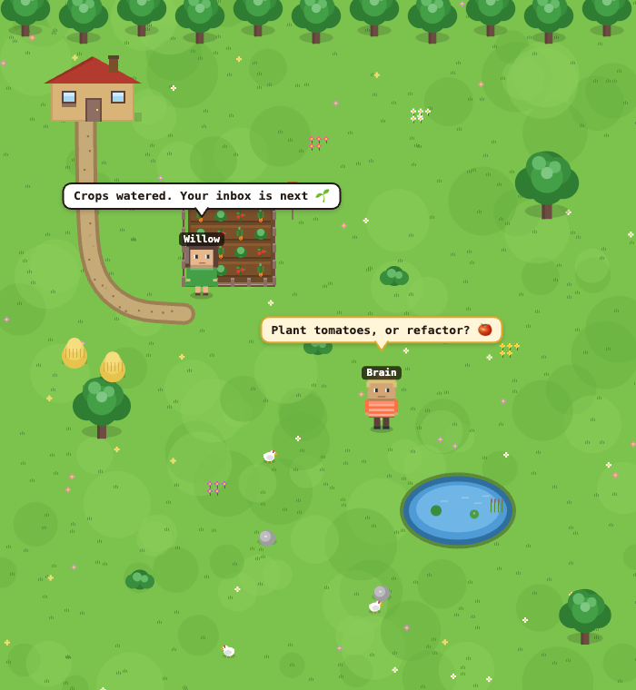
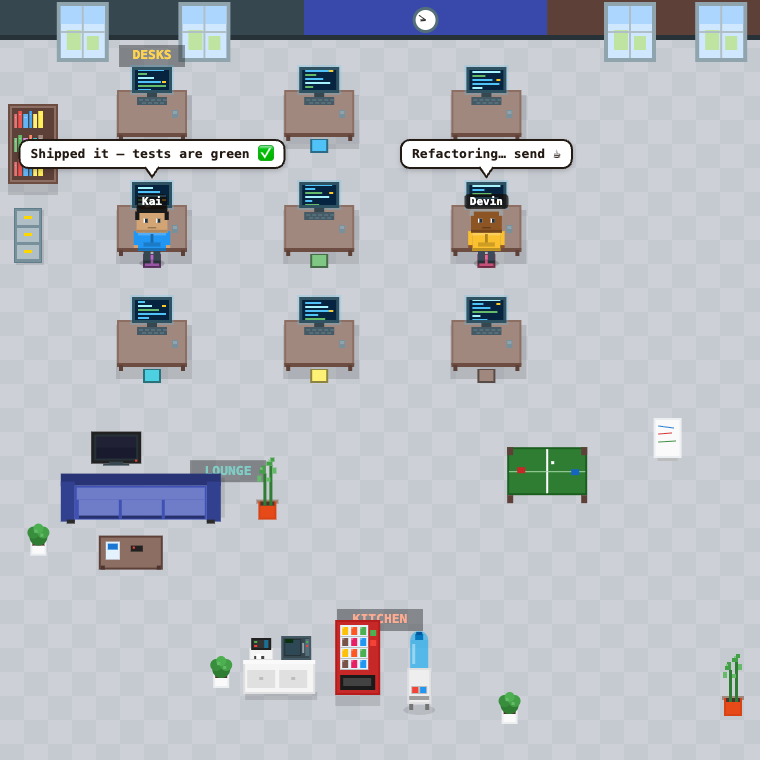

<div align="center">

# TaleSauce 🍅

### Your AI agents deserve a better home than a chat box.

**TaleSauce turns AI agents into pixel-art characters that live in a tiny 8-bit world** — they walk to their desks, tend the farm, take coffee breaks, ask you questions, and report back when the work is done. Stardew Valley meets your dev tools.


*A living farm and office, side by side. Every character is a real AI agent — they work, chat, and ask you questions. Every pixel is drawn in code.*

</div>

---

## ✨ The pitch

Most "AI agent" UIs are a text box and a spinner. TaleSauce asks a sillier, better question: **what if you could *watch* your agents work?**

<div align="center">


*Hand Kai a task — he walks to his desk and gets to work.*

</div>

Give an agent a task and it strolls to its workstation and gets busy. Needs a decision from you? It walks to the front of the stage and waves a question. Finished? It reports back, then wanders off to hang out by the pond. Each one is backed by a real, swappable "brain" — a hosted endpoint or a local coding CLI — so the cute little farmer in green is genuinely running Claude Code against your repo.

It's a toy. It's also a server-authoritative, fully-tested, real-time monorepo. Both things are true and that's the fun of it.

## 💬 You talk, they work

Click any character to open its chat. Hand it a task, and you watch the whole loop play out — it walks to its desk, does the work, **reports back when it's done**, and **stops to ask you** when there's a real decision to make. The same conversation drives the little pixel human on stage.


> 🟢 green bubble = *reported back* &nbsp;·&nbsp; 🟠 amber bubble = *needs your call* &nbsp;·&nbsp; the speech bubbles above each character mirror exactly what they're up to.

## 🎨 Every pixel is hand-coded — zero art packs

No tilesets. No sprite sheets. No asset store. **The entire world is drawn procedurally on a 2D canvas**, frame by frame, then streamed into Phaser as a live texture.

| 🌾 The Farm | 🏢 The Office |
|:---:|:---:|
|  |  |
| Textured grass, a winding dirt path, a tilled garden with crop rows + scarecrow, a rippling pond, treeline, and chickens that wander and peck. | Nine desks with animated "typing" code monitors, a lounge with a couch + TV, a stocked kitchen, a ping-pong table, and a wall clock. |

Characters are generated too — gender, skin, **9 hairstyles**, shirts, glasses — so no two agents look alike. They blink, bob, walk, and tap away at keyboards. (The renderers are adapted in spirit from the MIT-licensed [My Virtual Office](https://myvirtualoffice.ai) — code only, no images copied.)

## 🧠 One UI, four brains

Each agent is assigned a **brain kind** — and they all walk, talk, and report through the exact same interface:

| Brain | What it is |
|---|---|
| 🟣 **OpenClaw** | Hosted, OpenAI-compatible chat endpoint — great for general agent behavior. |
| 🟠 **Claude Code** | Local Claude Code session pointed at a real repo, with an interactive permission flow for risky tools. |
| 🔴 **Codex CLI** | OpenAI's `codex` binary as a sandboxed coding assistant. |
| 🔵 **Cursor CLI** | `cursor-agent` running as just another local coding brain. |

Point a coding agent at a working directory and it'll actually do the work — tool activity surfaces live in its speech bubble as it goes.

## 🪄 The experience

- **Split-stage world** — farm and office run side by side; drag the divider to rebalance, or toggle to focus one full-screen.
- **Living idle behavior** — idle agents take coffee/water breaks; desk workers type; chickens peck.
- **Click anyone to chat** — a bottom drawer slides up with the conversation, the agent's environment, and its brain.
- **Focus-aware everything** — the ambient soundtrack and the agent dock follow whichever side you're looking at.
- **Real-time and honest** — the server owns the truth; the client just renders the story. Reconnect and the world is exactly where you left it.

## 🏗️ Under the hood

A clean npm-workspaces monorepo, TypeScript end to end:

```
packages/
├─ shared/   → the TypeScript contract (WS/REST event union) both sides import
├─ server/   → Fastify v5 + WebSocket · orchestrator · SQLite · the four brains
└─ web/      → Vite + React 18 + Phaser 3 · procedural renderers · zustand store
```

The interesting bits:

- **Server-authoritative state.** Every change is a `ServerEvent` broadcast over WebSocket; the client reduces that stream into the world. No client-side guessing.
- **Swappable brains behind one interface.** `AgentBrain` normalizes four very different backends (HTTP streaming, local sessions, two CLIs) into the same token / question / result / permission events.
- **Procedural rendering pipeline.** Each scene draws to an offscreen canvas, uploads it as a Phaser texture, and refreshes ~10fps for animation — responsive and crisp via `Scale.NONE` + a `ResizeObserver`.
- **Tested.** 121 Vitest unit tests cover the brains, capability detection, orchestrator event mapping, SQLite persistence, and the client reducer.

## 🚀 Run it locally

```bash
npm install
cp .env.example .env     # configure at least one brain (see below)
npm run dev              # server + web, concurrently
```

Open **http://localhost:5173**. With no brain configured, TaleSauce shows friendly onboarding instead of a broken world.

### Configure a brain in `.env`

The server detects capabilities from your environment — set up whichever you have:

```bash
# OpenClaw (hosted, OpenAI-compatible)
OPENCLAW_API_URL=...your endpoint...
OPENCLAW_API_KEY=...your key...

# Claude Code (local session or Anthropic key)
CLAUDE_CODE_ENABLED=true
# ANTHROPIC_API_KEY=sk-ant-...

# Codex CLI   (needs: npm i -g @openai/codex && codex login)
CODEX_ENABLED=true

# Cursor CLI  (needs: cursor-agent installed and logged in)
CURSOR_ENABLED=true

# Prefer one when several are available
# DEFAULT_BRAIN=claudecode
```

### Scripts

| Command | Does |
|---|---|
| `npm run dev` | Run server + web together |
| `npm run build` | Build shared → server → web |
| `npm test` | Run the full Vitest suite |

## 📜 Credits & license

A **private, non-commercial portfolio project.** The farm, office, and characters are drawn entirely in code — there are no bundled image assets. The only binary assets are audio (Kenney CC0 sound effects and Pixabay ambient loops). Full attribution in **[LICENSES.md](LICENSES.md)**.

<div align="center">

*Made with 🍅 — because AI can be more than a text box.*

</div>
