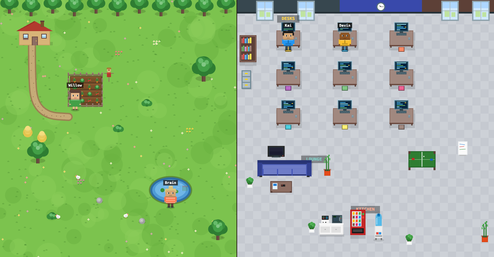
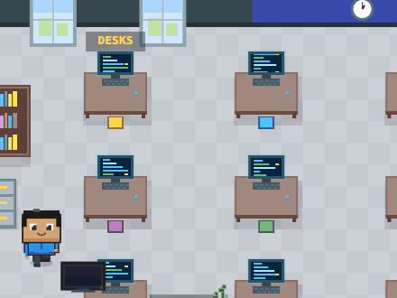
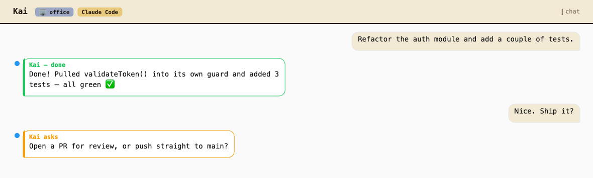
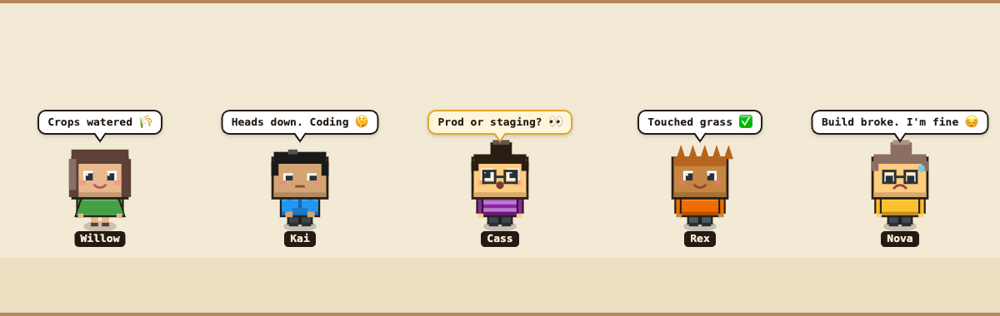

<div align="center">

# TaleSauce 🍅

### Your AI agents deserve a better home than a chat box.

**TaleSauce turns AI agents into pixel-art characters that live in a tiny 8-bit world.** They walk to their desks, tend the farm, take coffee breaks, ask you questions, and report back when the work is done. Stardew Valley meets your dev tools.




*A living farm and office, side by side. Every character is a real AI agent that works, chats, and asks you questions. Every pixel is drawn in code.*

</div>

---

## ✨ The pitch

Most "AI agent" UIs are a text box and a spinner. TaleSauce asks a sillier, better question: **what if you could *watch* your agents work?**

<div align="center">



*Hand Kai a task, and he walks to his desk and gets to work.*

</div>

Give an agent a task and it strolls to its workstation and gets busy. Needs a decision from you? It walks to the front of the stage and waves a question. Finished? It reports back, then wanders off to hang out by the pond. Each one is backed by a real, swappable "brain" (a hosted endpoint or a local coding CLI), so the cute little farmer in green is genuinely running Claude Code against your repo.

It's a toy. It's also a server-authoritative, fully-tested, real-time monorepo. Both things are true and that's the fun of it.

## 💬 You talk, they work

Click any character to open its chat. Hand it a task, and you watch the whole loop play out: it walks to its desk, does the work, **reports back when it's done**, and **stops to ask you** when there's a real decision to make. The same conversation drives the little pixel human on stage.



> 🟢 green bubble = *reported back* &nbsp;·&nbsp; 🟠 amber bubble = *needs your call* &nbsp;·&nbsp; the speech bubbles above each character mirror exactly what they're up to.

## 🎭 Meet the cast

No two agents look alike. Each one's appearance is deterministically rolled from genders, **9 hairstyles**, skin tones, outfits, and glasses, and the face *emotes* with what the agent is doing: 😊 happy when idle, 🤓 heads-down while working, 😮 wide-eyed when it needs your call, 😟 glum when a build breaks.



And it's **100% hand-coded**: no tilesets, no sprite sheets, no asset store. Every character above, plus the entire farm and office behind them, is drawn pixel-by-pixel on a 2D canvas and streamed into Phaser as a live texture. (Renderers adapted in spirit from the MIT-licensed [My Virtual Office](https://myvirtualoffice.ai); code only, no images copied.)

## 🧠 Swappable brains, one UI

Every agent is backed by a **brain**, and they all walk, talk, and report through the exact same interface:

| Brain | What it is |
|---|---|
| 🟣 **OpenClaw** | Hosted, OpenAI-compatible chat endpoint, great for general agent behavior. |
| 🟠 **Claude Code** | A local Claude Code session pointed at a real repo, with an interactive permission flow for risky tools. |
| 🔴 **Codex CLI** | OpenAI's `codex` running sandboxed via `codex exec --json`. Set `CODEX_ENABLED=true` with `codex` on your PATH (after `codex login`). |
| 🔵 **Cursor CLI** | `cursor-agent -p --output-format stream-json`, sandboxed. Set `CURSOR_ENABLED=true` with `cursor-agent` on your PATH. |

Point a coding agent at a working directory and it'll actually do the work, with tool activity surfacing live in its speech bubble as it goes. The CLI brains run sandboxed with auto-approval, so they stream their work and report back rather than popping an Allow/Deny card.

## 🪄 The experience

- **Split-stage world.** Farm and office run side by side; drag the divider to rebalance, or toggle to focus one full-screen.
- **Living idle behavior.** Idle agents take coffee/water breaks; desk workers type; chickens peck.
- **Click anyone to chat.** A bottom drawer slides up with the conversation, the agent's environment, and its brain.
- **Focus-aware everything.** The ambient soundtrack and the agent dock follow whichever side you're looking at.
- **Real-time and honest.** The server owns the truth; the client just renders the story. Reconnect and the world is exactly where you left it.

## 🏗️ Under the hood

A clean npm-workspaces monorepo, TypeScript end to end:

```
packages/
├─ shared/   → the TypeScript contract (WS/REST event union) both sides import
├─ server/   → Fastify v5 + WebSocket · orchestrator · SQLite · swappable brains
└─ web/      → Vite + React 18 + Phaser 3 · procedural renderers · zustand store
```

The interesting bits:

- **Server-authoritative state.** Every change is a `ServerEvent` broadcast over WebSocket; the client reduces that stream into the world. No client-side guessing.
- **Swappable brains behind one interface.** `AgentBrain` normalizes very different backends (a streaming HTTP API, local Claude Code sessions, CLI coding agents) into the same token / question / result / permission events.
- **Procedural rendering pipeline.** Each scene draws to an offscreen canvas, uploads it as a Phaser texture, and refreshes ~10fps for animation, staying responsive and crisp via `Scale.NONE` + a `ResizeObserver`.
- **Tested.** 121 Vitest unit tests cover the brains, capability detection, orchestrator event mapping, SQLite persistence, and the client reducer.

## 🚀 Run it locally

```bash
npm install
cp .env.example .env     # configure at least one brain (see below)
npm run dev              # server + web, concurrently
```

Open **http://localhost:5173**. With no brain configured, TaleSauce shows friendly onboarding instead of a broken world.

### Configure a brain in `.env`

The server detects capabilities from your environment. Set up whichever you have:

```bash
# OpenClaw: OpenAI-compatible chat-completions endpoint
OPENCLAW_API_URL=https://your-openclaw-host/v1/chat/completions
OPENCLAW_API_KEY=your-key

# Claude Code: local session, or an Anthropic API key
CLAUDE_CODE_ENABLED=true
# ANTHROPIC_API_KEY=sk-ant-...

# Codex CLI: needs `codex` on PATH (codex login)
CODEX_ENABLED=true

# Cursor CLI: needs `cursor-agent` on PATH (cursor-agent login)
CURSOR_ENABLED=true

# Prefer one when several are configured
# DEFAULT_BRAIN=claudecode
```

> Codex and Cursor only show up once their binary resolves on your `PATH` *and* the matching flag is set, so enabling the flag without the CLI installed is a safe no-op.

### Scripts

| Command | Does |
|---|---|
| `npm run dev` | Run server + web together |
| `npm run build` | Build shared → server → web |
| `npm test` | Run the full Vitest suite |

## 📜 Credits & license

A **private, non-commercial portfolio project.** The farm, office, and characters are drawn entirely in code, so there are no bundled image assets. The only binary assets are audio (Kenney CC0 sound effects and Pixabay ambient loops). Full attribution in **[LICENSES.md](LICENSES.md)**.
